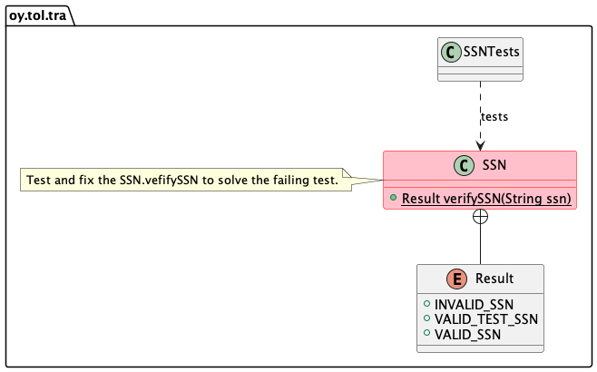

# Exercise 0

## The goals

The goals of this exercise are to:

1. Check that your tools are installed properly and you can use them. List of tools and instructions on how to get started are provided in Moodle.
1. Demonstrate how to run unit tests, since all course deliverables are unit tested.
1. Provide you a learning experience on how to execute tests to find bugs, analyse them and fix them.
1. Let you experiment how to deliver, using git, the fixed project for evaluation to your private remote repository.

The unit tests are *important* throughout the course:

1. You should unit test *all* your exercise tasks before submitting them for evaluation.
1. Teachers use automated scripts to unit test your deliverables and decide on acceptance.

If unit tests fail, the exercise task will not pass. You will know this immediately when You yourself execute the tests on your computer.

> Note that it is not allowed to change the unit tests. Teachers in any case replace your unit tests with the
> original ones when starting the tests, overwriting any possible changes you may have done to the tests.

## The exercise 0 steps

The structure of the exercise is shown in the UML diagram below.



Now, about this exercise. You can do everything from terminal window (a.k.a. command prompt). Testing from Visual Studio Code is described below.

1. cd to the directory where this project `00-init` is (the `pom.xml` file of the project is there).
1. Execute command `mvn test`.
1. See that some of the tests fail. Study the failed test to understand why it fails.
1. Fix the problem in the `SSN.verifySSN()` which causes the test to fail.
1. If you have issues finding the bug, use the VS Code debugger to find it.
1. When you think you have the bug fixed, execute the tests again to verify.

Note that it is *very* important to really *focus* on the error messages you see from the tests. Error messages show the relevant information you *need* to start investigating what happens:

```console
[INFO] -------------------------------------------------------
[INFO]  T E S T S
[INFO] -------------------------------------------------------
[INFO] Running oy.tol.tra.SSNTests
[ERROR] Tests run: 3, Failures: 0, Errors: 1, Skipped: 0, Time elapsed: 0.014 s <<< FAILURE! - in oy.tol.tra.SSNTests
[ERROR] invalidSSNTests  Time elapsed: 0.003 s  <<< ERROR!
java.lang.NumberFormatException: For input string: "1p4"
	at oy.tol.tra.SSNTests.invalidSSNTests(SSNTests.java:46)
```
From here you can find **four important facts**:

1. Running the tests resulted in an **error**.
1. Reason for failure was that **NumberFormatException** was thrown
1. Reason for that exeption was that code attempted to handle **string "1p4"** as a number
1. The error originated from a test in **SSNTests.java**, line number is also shown.

These facts should point you where to start investigating the issue and start planning a fix for it.

> Again, remember: do not change the tests, change the SSN implementation -- the problem is there, not in the tests.

## Testing from VS Code

Alternatively, you can execute the tests from the Visual Studio Code. The tests are already set up for you so check only instructions related to running the tests in the [VS Code documentation site](https://code.visualstudio.com/docs/java/java-testing).

1. Open the project in Visual Studio by opening the *folder* (a.k.a. directory) where the project (the `pom.xml` file) is located. Do *not* open individual .java files. Select File > Open... and select the *directory* `00-init`, opening the project.
1. VS Code imports the project, creating a VS Code Java project. This may take for a while.
1. Switch to the test view -- the symbol looking like a **lab bottle** in the left side of the VS Code window.

Press the run tests button that appear beside the tests when you hover the mouse over the tests in the list. Run command is the "play" button appearing beside the test. Play button with a small bug symbol can be used to run the tests in Debug mode. Quite useful when trying to find out the root cause of the bugs by stepping through code with breakpoints.

You probably want and need to **debug** the code to see, step by step, what is happening and what are the values in different variables. Use the VSC debugging feature to do that. Instructions for debugging can be found at the [VSC web pages](https://code.visualstudio.com/docs/java/java-debugging). Note that you need to debug in later exercises too. So better learn that now than later. Teachers will also show you how to debug in demonstrations and exercises.

## Delivery

Deliver the _fixed_ project to your private GitLab repository. This `00-init` submission does not influence your grade but
it is good to test how things should be done and that the whole toolchain works, before going to the exercises that do affect your grade.

Steps for the delivery are listed below. The steps assume you have cloned the project from Github Classroom.

1. **Verify** your fixes work by executing the tests with Maven: `mvn test`. Or execute the tests from Visual Studio Code.
1. **Verify** the address of the remote repository you cloned the local project from: `git remote -v`.
1. **View** changed files using command `git status`. With this exercise, you should have not created new files so there is no need to add new files to git.
1. If necessary or interested, **view the changes** using command `git diff`.
1. If tests pass and all seems to be ok, you are ready to commit and push.
1. **Commit** the changed files to the local git repository using command `git commit -am"Your commit message here"`. Use *meaningful* commit messages explaining what fixes or changes are you committing at this time!
1. **Publish** the changes to your private remote GitLab repository using `git push`.
1. **Verify** the changes are in the remote private repository of yours, by visiting it with your web browser and see the changes there.

## Issues or questions?

Ask in the lectures, exercises or online discussion groups.

## About

* Course material for Tietorakenteet ja algoritmit | Data structures and algorithms 2021-2022.
* Study Program for Information Processing Science, Department of Information Technology and Electrical Engineering, University of Oulu.
* (c) Antti Juustila 2021-2022, INTERACT Research Group.
* Implementation for NJIT:
* Pertti Karhapää, M3S Research Unit.
