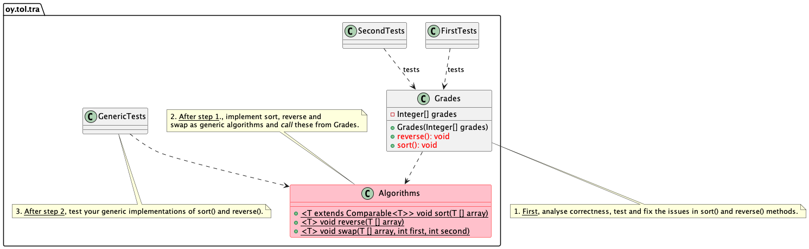

# Algorithm correctness - and simple slow sorting

Tietorakenteet ja algoritmit | Data structures and algorithms.

## The goal

* The goal of this exercise task is to analyse algorithm (reverse, sort) correctness.
* When you have analysed and tested that the algorithms are not correct, fix them.
* When the algorithms work, implement them as *generic* methods. They are then useful also later in the course.

Note that here you must implement the algorithms "in-place", and *not* by creating new arrays. Note also that you may not use Java container classes nor algorithms in implemeting this exercise task. So do not use `Arrays`, `Collections`, `Array`, `ArrayList` or any other container classes or algorithms here. Just plain arrays (e.g. `Integer [] array`) and basic conditional structures (if) and loops (for, while, etc.) plus basic data types like int, boolean, Integer and String.

## Prerequisites

You have all the tools installed and working. This was tested in the `00-init` exercise 
of the course. If you haven't done that yet, do it now.

Generic sort and generic classes in have been taught earlier in Programming 2 course. So take a look at those materials from that course if necessary.

## Instructions

The UML class diagram below shows the entities of this exercise.



The `Grades` class holds student grades in an `Integer` object array. Grades can then be **sorted** and **reversed**.

> Note that in Java **objects are never compared using the operators** `>`, `<`, `==`, `!=` etc. When comparing the object values, always use the `compareTo` -method!:

```Java
Integer someInteger;
Integer anotherInteger;
// ...
if (someInteger.compareTo(anotherInteger) == 0) { // Are the numbers equal?
   // ...
}
```

**First** execute **only** the `FirstTests` tests so that you can see the sort and reverse algoritms working.

You can run these tests from the command prompt or from VS Code. Running on the command prompt:

```
mvn -Dtest=FirstTests test
```
Or test from VS Code by choosing the test view (lab bottle view, see red highlighted rectangle in the image below) and by executing **only** the `FirstTests` test (blue rectangle) by pressing the run button (triangle):


Test seem to pass. But this is just an illusion -- the *tests are not adequate* and *fail* to reveal bugs in both `reverse()` and `sort()` methods.

**Now execute** the `SecondTests`, from the command line:

```console
mvn -Dtest=SecondTests test
```
And from VS Codesta by clicking the play button on the right side of the `SecondTests`.

Run the tests several times. You will see that sometiems they pass, but sometimes they do not. Sometimes one of the tests passes, sometimes the other. Why?


### First focus on the reverse method testing

Study the output of the *Debug Console* in VSCode. See for yourself sometimes the result is correct and sometimes not. What is the difference between those arrays that get reversed correctly and those that do not? Could this difference explain the strange behavior? Alternatively, you can also study the test code. Can you see, from the test code and the arrays used in the testing, something that would explain why some tests fail and some do not? How do the arrays differ in these cases?

You should see that the reverse does not always work as expected.

* **Study the code** and try to *reason* what is the issue with the implementation. Draw/write on paper to understand what is happening as you "run" the code in your head, assisted by the pen and paper.
* **Debug** the code with VS Code debugger by setting **breakpoints** and step the lines of code to see what is happening. View variable values. Execute the tests in the debugger by pressing the play button with the bug symbol in it.

As you begin to understand what the issue is, **fix it**. Execute the tests again to see if your fixes actually work or not. Make sure you have many various kinds of arrays and correct expected result arrays to compare to.

### Next focus on testing the sort method

You saw the original sort test pass. Now, run also this test several times. You should see that the sort does not always work as expected. Again, **try to see why some test fail as some do not**. 

* **Study the code** and try to *reason* what is the issue with the implementation. Draw/write on paper to understand what is happening as you "run" the code in your head, assisted by the pen and paper.
* **Debug** the tests with VS Code debugger by setting **breakpoints** and step the lines of code to see what is happening. View variable values.

As you begin to understand what the issue in the `Grades.java` is, **fix it**. Execute the test again to see if your fixes actually work or not. Make sure you have many various kinds of arrays and correct expected result arrays to compare to. 

> Tip: when sorting arrays, a single loop usually is not enough. You may want to check out e.g. simple insertion sort and see the pseudocode how that is implemented:

https://en.wikipedia.org/wiki/Insertion_sort

> Note: if your fixed code has only one loop and your solution is to restart the sorting from the end of the array after every swapping of values, you do not pass this exercise. This is not a good way to sort. So do study e.g. the insertion sort or bubble sort and implement those instead. Do not try to implement anything more complicated, since that will be a task for a later exercise in the course.

## Implement generic versions

`Grades` `sort()` and `reverse()` only work with `Integer` arrays. Sorting and reversing are things that can be done to any kind of elements in an array.

**Create** a new file `Algorithms.java` and implement sorting and reversing as *generic algorithms*.

**IMPORTANT!** Later exercises and tests, use these algorithms. So make sure the interfaces of reverse and sort look **exactly** like this:

```Java
public static <T extends Comparable<T>> void sort(T [] array) {
   // implementation here...

// ...
public static <T> void reverse(T [] array) {
   // implementation here... 
```
**Note** the comparison of objects! (see note below the first figure). You will not pass if you do not do this right.

**Change** the `Grades` implementation so that it calls the `Algorithms` generic methods.

**Note** also that both `sort` and `reverse` swap places of two elements in the array. Therefore, it is a good idea(tm) to implement this swapping operation as a generic method `swap` in the `Algorithms` class, used by both  `sort` and `reverse`.

If necessary, revisit the Programming 2 materials on generic methods and classes. Ask for help during teaching sessions.

Note that you will need the generic sort later in the exercises, so do not jump ahead skipping this task.

## Final test of the generic algorithms

In the root folder if this project, you will find a new test in the file `GenericTests.java`. **Move this file** to the test code directory `src/test/java/oy/tol/tra`. Now you can also use this new test to test your generic implementations. It will test your `reverse` and `sort` methods using both `Integer` and `String` arrays.

When the tests pass, you may deliver the exercise for evaluation and grading and continue to the next exercise.

## Delivery

When you have fixed the issues in the `reverse()` and `sort()` methods of `Grades` and have them implemented as generic methods, deliver your submission for evaluation as instructed in the course.

**Do not forget** to `git add` your `Algorithms.java` before committing and pushing to your remote repository! Also commit the moving of the `GenericTests.java` file to the test directory.

## Questions or problems?

Participate in the course lectures, exercises and online support group.

If you have issues building and running the tests, make sure you have the right JDK installed, environment variables (`PATH` and `JAVA_HOME`) are as they should, Maven is installed, and that git works properly.

## About

* Course material for Tietorakenteet ja algoritmit | Data structures and algorithms 2021-2022.
* Study Program for Information Processing Science, Department of Information Technology and Electrical Engineering, University of Oulu.
* (c) Antti Juustila, INTERACT Research Group.
* Implementation for NJIT:
* Pertti Karhapää, M3S Research Unit.
