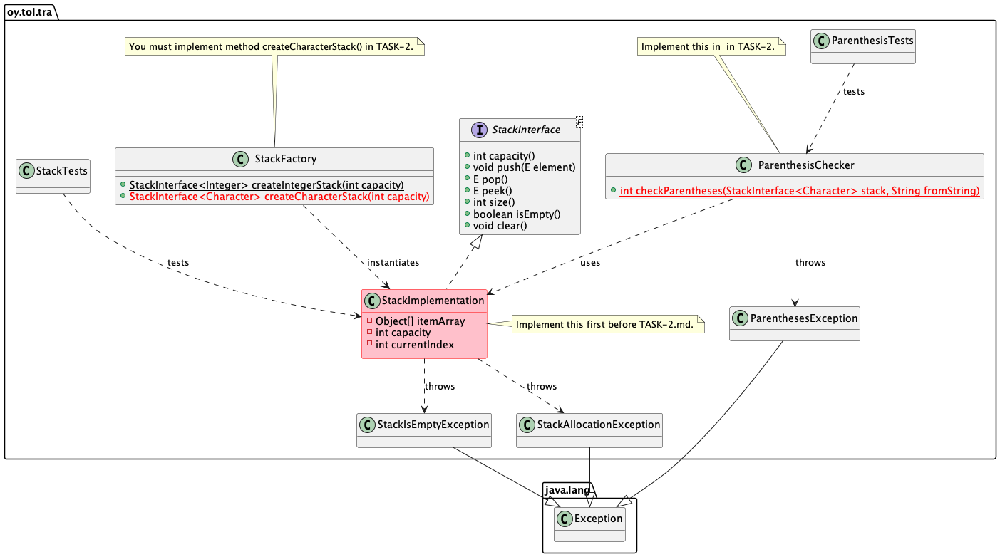

# Stack exercise

Data structures and algorithms 2024.

## The goal of task 1

* The goal of this exercise is to implement a Stack data structure.
* The implementation must pass all the tests included in the exercise.
* Time complexity requirements:
  * `capacity()`: O(1).
  * `push()`: O(1) except when reallocation must be done: O(n).
  * `pop()`: O(1).
  * `peek()`: O(1).
  * `size():` O(1).
  * `isEmpty():` O(1).
  * `toString()`: O(n).
  * `clear()`: O(1).

> When implementing `clear()` you may decide yourself if you want to keep the current capacity or will the capacity be the default capacity of a queue.

**Note** that the method `toString()` in this and later execises must be implemented using Java `StringBuilder`, **not**  by using the `String` by modifying and appending to a `String` object. When handling large amounts of data elements, with `String`, this is **hundreds of times slower** than using `StringBuilder`. **This has already been implemented for you**.

## Prerequisites

You have all the tools installed and working. This was tested in the `00-init` exercise of the course. If you haven't done that yet, do it now.

## Instructions

An overview of the classes in this exercise is shown in the UML class diagram below. Note that in this task, you only work with the `StackImplementation` class. The class `ParenthesisTChecker.java` and `StackFactory.createCharacterStack()` are not needed until you start working with the additional tasks.

> If you want to, you may crete your own main app file, for example in `src/main/java/oy/tol/tra/Main.java`, where you may implement your own main() method to experiment your stack implementation. However, the main goal of the exercise is to pass all the unit tests. Do not implement main() method to data structure classes or test classes!



You should **implement** the interface `StackInterface` in the `StackImplementation.java` which is already created for you and located in this project's `src/main/java/oy/tol/tra/` directory!

Note that the StackImplementation uses `E` template parameter for the `StackInterface`:

```Java
public class StackImplementation<E> implements StackInterface<E> {
```
So the stack is a generic (template) class.

Make sure to **read** the `StackInterface` documentation (the comments in the code) **carefully** so that your implementation follows the interface documentation. Obviously you need to know how stacks work in general, so **check out** the course lectures and other material on stack data structures.

In this exercise, you use the Java plain array as the internal data structure for holding the elements:

```Java
private Object [] itemArray;
```

Since *all* Java classes inherit from Object, we can create an array of Objects for the elements.

In the `StackImplemention`, constructors, follow the code comments and **allocate** the array of elements, in addition to other things you need to implement:

```Java
   itemArray = new Object[capacity];
```

Make sure to implement *reallocating more room* in the StackImplementation internal array if array is already full, when `push()` is called!

After you have implemented your stack class methods, you can see that it is already **instantiated** for you in `StackFactory.createIntegerStack()`. After this, you are ready to test your implementation.

> Note: The time complexity of the methods `pop()`, `peek()`, `size()` and `isEmpty()` must be O(1).

In your stack, **implement** also the method `String toString()` inherited from the  `Object` class:

```Java
@Override
public String toString() {
   ...
```
The string includes the contents of the stack "from the bottom" *exactly* in the following format, including commas and spaces:

```text
[110, 119, 121]
```

This example stack was created by calling `stack.push(110)`, `stack.push(119)` and `stack.push(121)`. An empty stack must return the string "[]". Note that the stack may contain *any* Java object, in addition to Integers!


## Testing 

**Run the StackTests tests** to make sure your stack implementation passes the unit tests. From command line, you can execute the tests (in the directory that contains the exercise `pom.xml` file):

```
mvn -Dtest=StackTests test
```

If the tests do not pass, you will see errors. Otherwise you will see that the tests succeed. If you have issues, fix your stack implementation and try again.

When working with this exercise, **do not**:

* Change the `StackInterface` class in any way.
* Change the unit tests in any way.

The stack interface implementation java file is the only file you need to edit in this exercise.

## Testing and debugging principles

Remember to always **carefully** read **what** the tests tell you if they fail. The tests always report what they *expected* to happen, and then what *actually* happened. Carefully *read* those messages of failing tests and think: **why** the expected did not happen?!

Study the *test code* that finds the issue and see *how* it uses your data structure up to the point where the test failed. Note that the root cause for the failure is not necessarily at that failed method -- it may be so that one of the *earlier* methods called by the test actually has the bug, but the symptom came out in the failed method call. So, for example, calling `pop()` may fail the test but the actual bug may actually be in the `push()` method. 

The reason for the failure may have happened *earlier*. Various methods change the state of your object, and if one state change failed, it may cause problems later when some other method is called and the state of the object is now corrupt.

So, what to do: put **breakpoints** either to the test code or to your code, before the place where the test failed. Then **debug** the tests. See demo videos in Moodle to see how this is done. Then when the code execution hits the breakpoint, *carefully* check what is the state of the object being tested. Is it correct? Should you see the things in the stack internal array that you are seeing? 

For example, if the test code added three items to the data structure before the breakpoint, are those three items in the internal array? Are they in correct order? Are the other member variables in the class as they should be, when three objects are in the array?

Then step over the code *slowly* to see what happens. Carefully think: is this what is now happening here what I *intented* my code to *actually* do? Do not assume your code works, but study if it really really works!

When the execution returns to the test code side, see how it fails and again think *why* it failed. If you could not see the reason for the failure, start the test debugging again. Collect information about how your code works, what is the state of things when it is executed, how the state changed and then again see why the test is still failing. Doing this iteratively should give you enough information to see what goes wrong and why.

During debugging, pay close attention to the debugger's **Variables view** and hover your mouse over the variables to see their values. VS Code also shows the variable values in the code editor view when debugging. Watch these values! Use this information to investigate what is happening and why.

When you find the root cause for the problem, fix the issue. And test again to verify your fix really works. Remember that you may create additional bugs when implementing fixes! 

Aim at simple code; unnecessarily complicated code usually is more buggy. Do not "try out" this and that and add more and more code randomly -- usually it is best to take a step back and think what actually should happen here are try to reach as simple as possible an implementation, fulfilling the requirements of the class and the API of it. 

## Delivery

When all tests pass, you commit and push to your remote repository.

## Questions or problems?

Participate in the course lectures, exercises and online support group.

If you have issues building and running the tests, make sure you have the tools working. This was done in the first exercise.

## About

* Course material for Tietorakenteet ja algoritmit | Data structures and algorithms 2021.
* Study Program for Information Processing Science, University of Oulu.
* Antti Juustila, INTERACT Research Group.
* Modified for NJIT implementation:
* Pertti Karhapää, M3S Research Unit.
