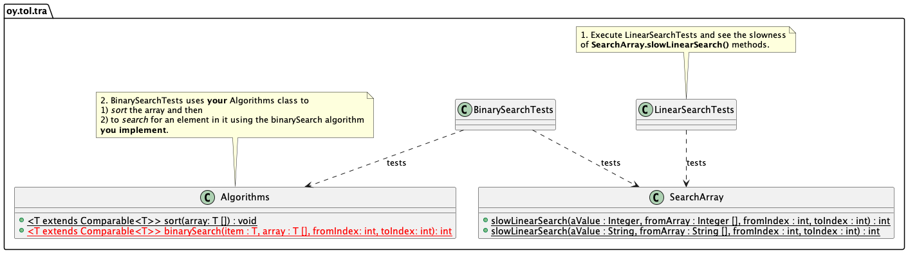

# Binary search - Applicatin of (slow) sorting

Data structures and algorithms 2024.

## The goal

* The goal of this exercise is to implement a **binary search** algorithm.

> Note that binary search **algorithm** *is not* the same thing as the *binary search tree* **data structure**! If you are unsure about this, check the course lectures!

The code provided to you already includes a linear search function -- it is used to compare the search speed of your binary search algorithm to linear serch.

The tests in this exercise execute both searches and test if the binary search is faster than the linear search.

The UML diagram showing the structure of the exercise is shown below.



## Prerequisites

You have all the tools installed and working. You have implemented in an earlier exercise (`01-arrays`) a simple sorting algorithm in the `Algorithms` class.

## Instructions step 1

You need to **copy** the `Algorithms` class from the previous exercise you used it, to the source code directory of *this exercise*. 

**Next, add** this code in the `Algorithms` class, the `binarySearch` algorithm template, still unfinished...:

```Java
public static <T extends Comparable<T>> int binarySearch(T aValue, T [] fromArray, int fromIndex, int toIndex) {
   // TODO: you will implement this in step 2 below.
   return 0;
}
```
...as a **generic method** . Then, in step 2, add this new method there, among the already implemented algorithms.

**Next** run *only* the linear search tests in `LinearSearchTests` to see how it performs. Linear search has been implemented for you in `SearchArray.slowLinearSearch` methods. Execute the test from the VS Code test view or from the command line:

```console
mvn -Dtest=LinearSearchTests test
```
In the class `SearchArray`, you can see the linear search algorithm implemented twice; once for `Integer` arrays and once for `String` arrays.

Linear search is slow. Also, note that here we have two identical implementations for the same  algorithm. No use of implementing same algorithm many times for different types. This is bad and not reusable.

This is why you will next implement the generic algorithm introduced in step 1 so that is is usable with all data types (implementing `Comparable` interface) and is reusable.

## Instructions step 2

**Next** you will implement the binary search algorithm, to the method you already added to the `Algorithms` class.

The binary search algorithm **requires** that the array to search is sorted. Calling binary search funtion with an unsorted container will fail. Lucky you, since you already implemented a generic sort algorithm in the `Algorithms` class in the exercise `01-arrays`!

You can see that the test class `BinarySearchTests` calls your `Algorithms.sort` -- this code *won't build* until you have the `Algorithms.java` in the excercise sources directory:

```Java
   // You must have implemented this as instructed in Exercise 01-arrays!
   Algorithms.sort(array);
```

Later in the test code, you can see that the `BinarySearchTests` calls your binary search implementation:

```Java
   int binaryIndex = Algorithms.binarySearch(toFind, array, 0, array.length - 1);
```

So, the tests first use your sort to sort the arrays, then your binary search implementation to be able to search data faster. 

When working with this exercise, **do not** change the unit tests in any way... until you are told to.

Next to testing how it succeeds.

## Testing 

**Run the BinarySearchTests** to make sure your implementation passes the unit tests. From command line, you can 
execute the tests (in the directory that contains the exercise `pom.xml` file):

```
mvn -Dtest=BinarySearchTests test
```

If the tests do not pass, you will see errors. Otherwise you will see that the tests succeed. If you have issues, fix your implementation and try again.

If you have problems with the implementation not working, check out the tests in the `BinarySearchTests.simpleSearchTest` test method. It uses a very simple and small sorted array to search for numbers in the array, and one number not in the array. Use this test to fix any problems in your algorithm. You can run this test from the VS Code by just running that test method, or from command line:

```console
mvn -Dtest=BinarySearchTests#simpleSearchTest test
```

When you execute the tests, you should see **printouts** from the test as they try to find elements from the arrays, either `Integer` or `String`. Finally the tests also print out the speed comparisons:

```console
Average linear search duration:     361129 ns
Average binary search duration:       3558 ns
```

You should see the binary search being *much faster* than the linear search. 

**There is only one but.**

The overall speed of the binary search *including sorting time* is much worse than linear search!:

```console
Sorting the array took 11329947083 ns
...
Average linear search duration:     361129 ns
Average binary search duration:       3558 ns
```

So what's the point?! We have **three** points:

1. Often in real life cases, the array only needs to be sorted *once* -- after that initial sort slowing the first binary search, sorting is no longer needed. After that, binary search is typically executed repeatedly and then overcomes the slowness of linear search, overall.
2. The sort algorithm you implemented in exercise `01-arrays` is probably insertion sort or bubble sort or something worse. It is very slow with large data sets. A faster sort can sort the array in this exercise about 1000 times faster.
3. Even with faster sorting algorithm, if you have to *always* sort the array before binary searching, probably you could do with linear search, since sorting time and binary search *combined* is probably slower. So you need to think, measure and apply the way that is faster in *your* context.

In this exercise the insertion sort (or bubble sort, if you implemented that in 01-arrays) shows that it is not fast enough for larger numbers of data elements. Therefore, in the following step, **you will learn to write faster sorting algorithms**.

## Instructions step 3

**Now**, you will implement a faster sorting algorithm that you will also need in later tasks. You can choose to implement any fast sorting algorihtm, but instructions to get started with Qicksort is provided here. This is because Quicksort is fairly easy to implement. It does not take many lines of code.

Into the `Algorithms.java` file add the following:

```Java
   public static <E extends Comparable<E>> void fastSort(E [] array) {
      quickSort(array, 0, array.length - 1);
   }
```

If you decide to implement some other fast sorting algorihtm, like heapsort or merge sort, you implement the call for that sorting and comment out the call for quikSort.

Following that, in the same file, you need...

```Java
   public static <E extends Comparable<E>> void quickSort(E [] array, int begin, int end) {
      // implement Quicksort here...
   }
```

...and the partition method required by Quicksort...

```Java
   private static <E extends Comparable<E>> int partition(E [] array, int begin, int end) {
      // implement partition here...
   }
```

At this point, since there are no separate tests implemented for this, **you need to modify the tests**. Find file `BinarySearchTests.java` and in that file lines 74 and 126. Both of these lines say:

```Java
   Algorithms.sort(array);
```

Change both of them to:

```Java
   Algorithms.fastSort(array);
```

After saving changes, run the `BinarySearchTests` again. Note how moch quicker you get the results this time! So, sorting did make a difference after all.

## Delivery

When done, commit your changes and push your changes to the remote repository for testing by course teachers.

## Questions or problems?

Participate in the course lectures, exercises and online support group.

## About

* Course material Data structures and algorithms 2021-2022.
* Study Program for Information Processing Science, University of Oulu.
* Antti Juustila, INTERACT Research Group.
* Modifications for NJIT implementation:
* Pertti Karhapää, M3S Research  Unit.
