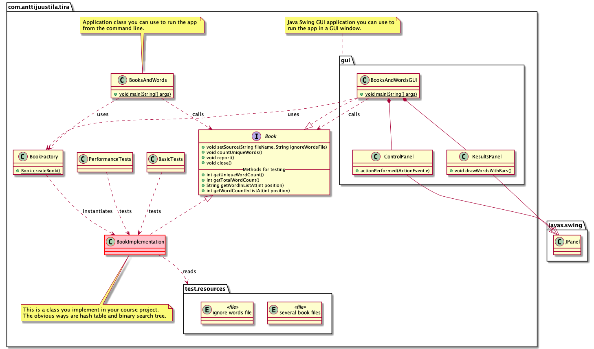

# BooksAndWords

Books and words is the final programming task of NJIT DSA in which you can implement a hash table or binary search tree for a grade of 4 or both for a grade of 5 (assuming you have done all previous tasks).

**NOTE!** This task may not work if you have cloned your local repository to a remote drive. If you have cloned to a remote drive, it is advisable that you clone again to your C: drive. Don't worry, all the changes that you have previously added, committed, and pushed will be cloned also.

## Brief description 

The application:

1. Reads a text file (Unicode, UTF-8 encoded) that contain often large amounts of text such as books. We will call this a **book** file.
2. Reads another small text file (Unicode, UTF-8 encoded), containing words to *ignore*. We will call this an **ignore file**.
3. Reads words from the book file, ignoring the words in the ignore file, and counts for each unique word, the number of times the word appears in the book.
4. Prints out a top 100 list of the most frquent words in the book, in descending order.

The application must be functionally correct, and also be time efficient. Execution time with the largest test file `Bulk.txt` should be seconds, not tens of seconds or minutes.

If you want to read the code documentation as HTML API documentation, you can create documentation with command `mvn javadoc:javadoc`. The documentation can then be found from project directory `target/site/apidocs/index.html`. (Not sure this works...)

An UML class diagram depicting the project is below.



**IMPORTANT NOTE** You must **not** use any Java container classes or algorithms in your implementation. Anything that directly or undirectly implements the Java `Collection` or `Map` interface, is a no-no. Any algorithms from the Java libraries, e.g. in `Arrays` or `Collections` is something you **must not use** in your code.

You **may** use -- and it is recommended to use -- any data structures and/or algorithms you implemented earlier during the course. For example in task `04-phonebook`. You can use the key-value pairs you implemented earlier, or if you think it is easier, implement new data structures all togehter. Also, utilize the `Algorithms` class you implemented throughout the course. So, **copy your `Algorithms.java` file to this task**.

## Detailed requirements

Detailed requirements for reading and reporting the words are:

1. Book files MUST be text only files and UTF-8 encoded (these are given to you).
1. Ignored words file MUST be text only files and UTF-8 encoded (this is given to you).
1. In the ignore file, the ignored words are separated with comma, no spaces in between.
1. The whole book file MUST be processed when counting the words.
1. All ignored words from ignore file MUST be taken into account.
1. Characters and words MUST be read as Unicode UTF-8 encoded, not ASCII, Latin-1 or any other encoding.
1. Only characters in the book file matching Java `Character.isLetter(int)` are considered as characters in a word. This can then be used to determine word breaks (characters are added to the word until a character that is NOT a letter is read).
1. One character words MUST also be ignored (*after* determining valid characters as specified above).
1. Words MUST be *normalized* to lowercase, that is "Hello" and "hello" are counted as the same word.
1. The functionality MUST be created by implementing the `Book` interface. 
1. You MUST NOT change *anything* in the `Book` interface.
1. After counting word occurrences, the app MUST report (print to console) top 100 word occurrences sorted in *descending* order.
1. The top-100 list MUST be shorter if the file has less than 100 unique words. E.g. if a file had 42 unique words, list length is 42.
1. Output MUST also include *counts* listed below when reporting the application output.
1. Methods marked in the source code comments in `Book.java` "For testing and evaluation" MUST return valid values. These are used in automatic tests, which fail if returned values differ (too much) from expected.
1. The methods implementing the Book interface MUST NOT contain ANY UI input code asking input/confirmation from users. This would halt the processing and disturb measuring the time performance.

## Implementing the Book interface
 
Implement the `Book` interface so that it fulfills the requirements for the course work, utilizing learnings from the course. Note that you must **create a new .java file** and implement your class there.

How to use the Book interface implementation from the rest of the code and tests?

Instantiate your concrete implementation by implementing the method `BookFactory.createBook()`. It must return your implementation of the Book interface class.
 
Book interface methods MUST be called in this order by the client app:

1. `setSource(String, String)`, providing path/file names of a valid existing book file and ignore file. The `Book` implementation MUST NOT change the given filename/paths in any way. Put these file names to member variables, and start processing the files in the next step.
1. `countUniqueWords()`, starting the actual processing: open the files and start counting words, ignoring some as described in the requirements.
1. `report()`, printing out the top-100 list, sorted descending by word count, and other information to report (see above and below).
1. `close()`, releasing all resources (memory, closing open files,...) taken by the app before it is shut down.
 
 Here is an example of how to use the methods:

 ```Java
  Book theBook = BookFactory.createBook();
  theBook.setSource(bookFile, wordsToIgnoreFile);
  theBook.countUniqueWords();  
  theBook.report();
  theBook.close();
```

## Reporting the word counts

The application must report the results after analysing the book as described above. The reporting is done in the `Book.report()` method implementation.

The method MUST:

1. Print out to the console the top 100 list of words by occurrence, sorted by descending order (most often used word first).
2. MUST print a shorter list if the file has less than 100 unique words.
3. Print out, *after* the top list:
   * the count of total number of words in the book.
   * the count of unique words in the book.
   * the count of words to ignore.
   * the count of words ignored in the book file.

Additionally, you SHOULD print out information specific to your algorithm. For example, if you use hash tables, print the number of collisions that happened with your hash function when you add words to the hash table. If you use binary search trees, you could print the deepest level of search done while looking for or placing a word in the tree (the height of the tree). And so on.

This information helps you in finding the time efficiency of your implementation. For example, if you have lots of collisions with hash table, printing out this information tells you that either the hash function you implemented is not good or your hash table is too small -- or both. You can then fix these to get an implementation that is better. Less collisions means faster algorithm, since the app is spending less time in handling collisions.

## Tips

If your implementation has strange crashes with large data sets and you are using recursive algorithms (e.g. quicksort), check out the [WHAT-STACKOVERFLOW.md](/WHAT-STACKOVERFLOW.md). 

**Review** the course lectures about hash tables or binary search trees. Those are the solutions that you have to implement.

**Study** the `BadBookImplementation` to learn how the solution can be built. You should of course use more efficient data structures, and sorting and other possibel algrithms from your own `Algorithms` class.

You can also test with the `BadBookImplementation`, after you have unzipped the test files, without doing any any implementation of your own. So, test it and see that it works. Just keep in mind that it is sloooow.

## Testing

The project contains JUnit tests that your implementation must pass.

NB: The tests use test files from directory `src/test/resources/`. There is a `testfiles.zip` in there, thath **you need to unzip** before testing. The test files must be unzipped to the same `src/test/resources/` directory. Otherwise the tests won't find the files.

`BasicTests` use your implementation to handle some of the test files in `src/test/resources/` directory. The count of words and word occurrences for those files are known. The tests compare what your implementation returns to the known values. If they differ, your implementation does not fulfill the requirements specified above. Find the issues and fix them for tests to pass.

`PerformanceTests` execute your `Book` implementation with the test book files. Execution times and other results obtained from the `Book` interface methods are printed to a text file `compare.csv`. This is a comma separated file you can open in any spreadsheet app. Use it to compare how your implementation time complexity is doing when the size of the data (the n) is going up. Execute these test preferably from the command line. If you execute them from Visual Studio Code or any other IDE, make sure you **Run** these tests, do not **Debug** these tests. Debugging slows down the execution and provides then unrealistic execution times.

Use the spreadsheet app with the `compare.csv` file to see how your implementation looks like; use the columns to draw charts to see how the execution time grows as the size of the book file grows. Is the time complexity perhaps linear, logarithmic, linearithmic, quadratic, cubic, exponential or factorial?

## Delivery

Before delivering your final submission, **create** a new markdown file `REPORT.md` in the project root directory (the same directory where this file is in). 

In that file, report (you do not have to use many words, just short and quick answers):

1. What is your hash function like for hash table solution (if you implemented hash table).
1. For binary search trees (if you implemented it), how does your implementation get the top-100 list?
1. What can you say about the **correctness** of your implementation? Any issues, bugs or problems you couldn't solve? Any idea why the problem persists and what could perhaps be the solution?
1. What can you say about the **time complexity** of your implementation? How efficient is the code in reading and managing the words and their counts? How efficient is your code in getting the top-100 list? Which sorting algorithm are you using? What is the time complexity of that algorithm?
1. What did you find the **most difficult things** to understand and implement in this programming task? Why?
1. What did you learn doing this?

Also save an image (screenshot) of the spreadsheet graph depicting the execution times with different sizes of test files as reported in the  `compare.csv`.

Don't forget to **add these files to git**: `compare.csv`, `REPORT.md` and the screenshot image file. 

Remember to use `git status` to see that all changes have been committed to your local repository. If not, do `git add` and `git commit` as necessary. Then deliver your project to your remote git repository using `git push`. Check using your browser to see the remote repository has all the necessary files with correct versions. Teachers are inspecting the version in your remote git repository, not the one on your personal computer. If the remote repository is missing files or has old versions of files, this will lead to problems.

Good luck!
